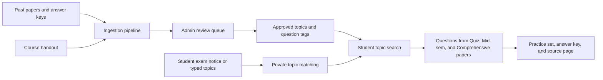
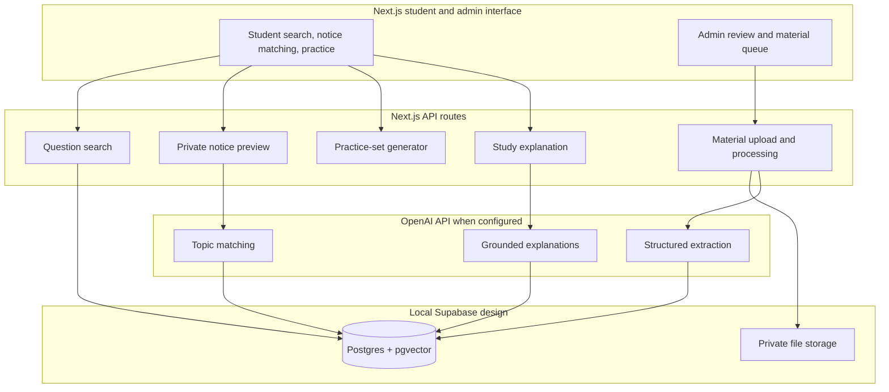

# AI Library Assistant

> A topic-first past-paper search and practice tool for BITS Pilani, Dubai Campus students.

Students usually receive a complete past paper as a PDF. That makes it difficult to answer practical revision questions: *Which past questions cover this topic?* *Has it appeared in quizzes, mid-sems, or comprehensive exams?* *What should I study from the topics listed in my exam notice?*

I built AI Library Assistant to turn an unstructured collection of papers, handouts, answer keys, and exam notices into a focused study experience. Instead of opening paper after paper manually, a student can select a syllabus topic, search a concept, or use an exam notice to retrieve relevant questions across every assessment type.

The current pilot is seeded with **GS F211 - Modern Political Concepts** material for BITS Pilani, Dubai Campus.

## What it does

- Search reviewed questions by syllabus topic or free text.
- Search **Quiz, Mid-semester, and Comprehensive** papers together by default, then narrow to a single assessment type when needed.
- Select one or more official topics from the course handout.
- Paste topics from an exam notice to receive suggested course-topic matches. Notice text stays in the current browser session.
- Create a short practice set from the current search results.
- Open the original source material from every question card.
- Reveal verified answer-key content where it exists; show an AI study-explanation state for questions without a linked key.
- Switch between Student and Admin views during local development.
- Review the ingestion queue, source materials, and approved course topic map in the Admin view.

## Why this is useful

The project removes the manual workflow of opening year-labelled PDFs one at a time and guessing which questions match a teacher's topic list. It is designed around a simple rule: **students search for what they are learning, while the original paper remains the source of truth.**

Course handouts define the syllabus language. Past papers provide the questions. Exam notices help students choose the right slice of the syllabus for an upcoming assessment. This makes it possible to find a Marxism question from a comprehensive paper while preparing for a quiz, or to focus on a single topic such as Liberalism without losing the source context.

## Product flow



## Architecture



## Technology

| Area | Choice | Purpose |
|---|---|---|
| Web application | Next.js, TypeScript, React | Modern local web interface and API routes |
| Styling | Tailwind CSS | Responsive BITS-inspired visual system |
| Database design | Supabase PostgreSQL + pgvector | Course metadata, source pages, questions, tags, and semantic retrieval |
| Storage design | Supabase Storage | Original paper, handout, answer-key, and future upload storage |
| Document processing | `pdf-parse` and Mammoth | PDF and DOCX text extraction |
| AI integration | OpenAI Responses API | Explanations and the planned structured extraction and topic-matching workflow |

## Project structure

```text
app/                     Student UI, admin UI, and API routes
lib/                     Shared data types and GS F211 local seed data
scripts/                 Source-file ingestion preparation
supabase/migrations/     PostgreSQL and pgvector schema
papers/                  Local past papers and answer keys (excluded from Git)
course handout /         Local course handout (excluded from Git)
exam notices /           Local notice fixtures (excluded from Git)
public/materials/        Local source previews served by the app (excluded from Git)
```

## Run locally

### Prerequisites

- Node.js 20 or later
- npm
- Docker Desktop if you want to run the local Supabase stack
- An OpenAI API key only if you want generated study explanations

### Start the app

```bash
git clone https://github.com/sanya28wd/AI-Library-Assistant.git
cd AI-Library-Assistant
npm install
npm run ingest
npm run dev
```

Open [http://localhost:3000](http://localhost:3000).

The starter interface works with the reviewed GS F211 seed dataset in `lib/seed.ts`. To ingest your authorized course material, create `papers/`, `course handout /`, and `exam notices /` folders, add the source files, then run `npm run ingest`. The script hashes files, extracts text, flags weak PDF extraction for OCR review, and writes a local review catalogue to `data/ingested-materials.json`.

The repository intentionally excludes course PDFs, answer keys, notices, generated catalogues, and local source previews. That prevents academic material and student notices from being published through GitHub.

### Enable AI explanations

```bash
cp .env.example .env.local
```

Add your key:

```text
OPENAI_API_KEY=your_key_here
```

Keys are excluded from Git through `.gitignore`.

### Start local Supabase

The repository includes the initial migration at `supabase/migrations/001_initial_schema.sql`.

```bash
npx supabase start
```

It creates the database model for `Subject`, `Topic`, `CourseMaterial`, `MaterialPage`, `Question`, `QuestionTopic`, and `AnswerKeyLink`. Student exam notices are intentionally excluded from this persistent model.

## API surface

| Route | Purpose |
|---|---|
| `GET /api/questions` | Filter reviewed questions by topic, assessment type, and free text |
| `POST /api/notices/preview` | Return temporary course-topic suggestions from notice text |
| `POST /api/practice-sets` | Create a filtered, randomized practice set |
| `POST /api/questions/:id/explanation` | Return a verified answer or AI study explanation |
| `POST /api/admin/materials` | Queue an uploaded course material file for review |
| `POST /api/admin/materials/:id/process` | Process a queued material item |
| `POST /api/admin/questions/:id/publish` | Publish an approved question |

## Privacy and review principles

- An exam notice is only used to identify topics for the student who supplied it. The local notice-preview route does not write notice content to the database.
- AI-generated tags and extracted questions should be reviewed by an admin before they are published for student search.
- Original source files and page numbers remain attached to every question so a student can verify context.
- Generated explanations are distinct from verified answer-key content.

## Current pilot scope

This first version focuses on the GS F211 local dataset and a development role switch. It is prepared for a Supabase-backed admin workflow, but campus single sign-on, production hosting, durable student accounts, progress tracking, and multi-subject rollout are intentionally future work.

## Contributing

For a new subject, add its handout, papers, and answer keys through the planned Admin workflow; then create and approve the subject's topic map before publishing its questions. Keep the source material available and review AI suggestions before students rely on them.
